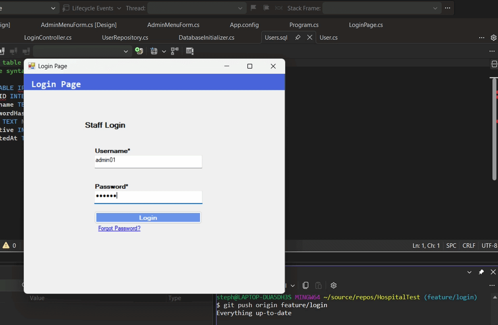

# Hospital Admission and Billing System

**Group 4 | BT3101**
Stephen William De Jesus · Lynet Cielo · Luster Tamanu Mangaliman · Neil Jerson Manalo

A hospital admission and billing system with role-based access for **Admin** and **Hospital Staff**.

Built using a four-project architecture:

* **Model** — Data models and entities
* **BusinessLogic** — Controllers and repositories
* **DB** — Database scripts
* **UI** — Windows Forms application

---

## 🔑 Demo Login Credentials

These are the two test accounts seeded into the database:

| Role           | Username  | Password   |
| -------------- | --------- | ---------- |
| Admin          | `admin01` | `admin123` |
| Hospital Staff | `areyes`  | `staff123` |

> **Note:** These credentials are intended for development and testing purposes only. Passwords are stored as **SHA256 hashes**, never in plain text.

---

## 📋 Project Kanban Board

Track the project's tasks, progress, and development status through our GitHub Kanban Board:

### [🔗 View Group 4 Kanban Board](https://github.com/users/bogiiiie/projects/4)

---

## 🎬 Demo

### Login and Role-Based Main Menu

<p align="center">
  
</p>

---

## 👥 Team Roles

| Member                   | GitHub                                                             | Role(s)                                                           |
| ------------------------ | ------------------------------------------------------------------ | ----------------------------------------------------------------- |
| Stephen William De Jesus | [@bogiiiie](https://github.com/bogiiiie)                           | Product Owner + Reviewer + Database Developer + Backend Developer |
| Lynet Cielo              | [@lynet-cielo-disputado](https://github.com/lynet-cielo-disputado) | UX/UI Designer + Frontend Developer                               |
| Luster Tamanu Mangaliman | [@lstrmangaliman-hue](https://github.com/lstrmangaliman-hue)       | Backend Developer                                                 |
| Neil Jerson Manalo       | Pending collaborator                                               | Backend Developer                                                 |

---

## 📦 Modules

| #  | Module                             | Status        |
| -- | ---------------------------------- | ------------- |
| 1  | Login & Main Menu (role-based)     | ✅ **Done**    |
| 2  | Room Management                    | ⬜ Not started |
| 3  | Patient Information Maintenance    | ⬜ Not started |
| 4  | Patient Info Search                | ⬜ Not started |
| 5  | Patient Room Search                | ⬜ Not started |
| 6  | Admission                          | ⬜ Not started |
| 7  | Admission Log History (Optional)   | ⬜ Not started |
| 8  | Treatment/Billing Breakdown        | ⬜ Not started |
| 9  | Doctor/Nurse Assignment (Optional) | ⬜ Not started |
| 10 | Billing                            | ⬜ Not started |
| 11 | Discharge                          | ⬜ Not started |
| 12 | Discharge Summary                  | ⬜ Not started |

---

## ✅ Progress Tracker

### Done

* **US-001 Role-Based Navigation** — Main Menu shows different tiles for Admin and Hospital Staff.
* **US-002 Login** — SHA256 password hashing with SQLite database, automatically created on first run.
* **Database Initialization** — `DatabaseInitializer.EnsureDatabase()` creates and seeds the database.
* **UI Wiring** — `LoginPage` is connected to `LoginController` and role-based menu forms.
* **Demo GIF** — `assets/LoginDemo.gif` shows the working login flow.

### In Progress

* *(Nothing currently)*

### Not Started

* **US-003a / US-003b** — Room Management
* **US-004a / US-004b** — Patient Information Maintenance
* **US-005** — Patient Info Search
* **US-006** — Patient Room Search
* **US-007a / US-007b** — Admission
* **US-008** — Admission Log History (Optional)
* **US-009** — Treatment/Billing Breakdown
* **US-010** — Doctor/Nurse Assignment (Optional)
* **US-011a / US-011b** — Billing
* **US-012** — Discharge
* **US-013** — Discharge Summary

---

## 🗂️ Project Structure

```text
HospitalAdmissionAndBillingSystem/
│
├── Model/
│   └── # Data models and entities
│
├── BusinessLogic/
│   ├── Controller/
│   │   └── # Business rules, validation, and application logic
│   │
│   └── Repository/
│       └── # Database access and data operations
│
├── DB/
│   ├── Table/
│   │   └── # Table creation scripts
│   │
│   ├── View/
│   │   └── # Database view scripts
│   │
│   ├── StoredProc/
│   │   └── # Stored procedure scripts
│   │
│   └── PostScript/
│       └── # Post-database setup scripts
│
├── UI/
│   ├── App_Data/
│   │   └── # SQLite database file
│   │
│   └── # Windows Forms application
│
├── assets/
│   └── LoginDemo.gif
│
└── README.md
```

### Architecture Overview

```text
┌───────────────────────────────────────────────────────────┐
│                          UI                               │
│                 Windows Forms Application                 │
│    (LoginPage, AdminMenuForm, HospitalStaffMenuForm)      │
└───────────────────────────┬───────────────────────────────┘
                            │
                            │ calls
                            ▼
┌───────────────────────────────────────────────────────────┐
│                     BusinessLogic                         │
│                                                           │
│   ┌───────────────────┐         ┌─────────────────────┐  │
│   │    Controller     │────────▶│     Repository      │  │
│   │  (LoginController)│         │  (UserRepository,   │  │
│   │                   │         │   DatabaseInitializer)│ │
│   │  Business rules   │         │  Database access    │  │
│   └─────────┬─────────┘         └──────────┬──────────┘  │
└─────────────┼──────────────────────────────┼─────────────┘
              │                              │
              │ uses                         │ reads/writes
              ▼                              ▼
      ┌──────────────┐              ┌──────────────────┐
      │    Model     │              │   SQLite (.db)   │
      │              │              │                  │
      │  User.cs     │              │  UI/App_Data/    │
      │  Room.cs     │              │  HospitalDB.db   │
      │  Patient.cs  │              │                  │
      └──────────────┘              └──────────────────┘

      ┌──────────────────────────────────────┐
      │              DB Project              │
      │   (SQL scripts — documentation and   │
      │    reference only; runs at runtime   │
      │    through DatabaseInitializer.cs)   │
      └──────────────────────────────────────┘
```

---

## 🧪 Test Accounts

The same demo credentials are also provided here for reference:

| Role           | Username  | Password   |
| -------------- | --------- | ---------- |
| Admin          | `admin01` | `admin123` |
| Hospital Staff | `areyes`  | `staff123` |

Passwords are stored as **SHA256 hashes**, never in plain text.

---

## 🛠️ Tech Stack

* **Language:** C# (.NET Framework 4.7.2)
* **UI:** Windows Forms
* **Database:** SQLite (`System.Data.SQLite.Core`)
* **Version Control:** Git + GitHub
* **Workflow:** Feature Branches → Pull Requests → Review → Merge

---

## 🚀 How to Run

### 1. Clone the Repository

```bash
git clone https://github.com/bogiiiie/HospitalAdmissionAndBillingSystem.git
```

### 2. Open the Project

Open the solution in **Visual Studio**.

### 3. Restore Dependencies

Restore the required NuGet packages, including:

```text
System.Data.SQLite.Core
```

### 4. Run the Application

Build and run the project.

The SQLite database will be automatically created and initialized on the first run through:

```csharp
DatabaseInitializer.EnsureDatabase();
```

### 5. Log In

Use one of the demo accounts provided at the top of this README.

---

## 🔐 Role-Based Access

The system provides different access levels depending on the logged-in user's role.

### Admin

The Admin account has access to administrative functions available through the Admin Main Menu.

### Hospital Staff

The Hospital Staff account has access to hospital staff functions available through the Hospital Staff Main Menu.

The role is determined during login and is used to display the appropriate main menu.

---

## 🌱 Development Workflow

The project follows a feature-branch workflow:

```text
Feature Branch
      │
      ▼
 Development
      │
      ▼
 Pull Request
      │
      ▼
 Code Review
      │
      ▼
   Approval
      │
      ▼
    Merge
```

Each feature is developed in its own branch before being reviewed and merged into the main project.

---

## 📌 Current Status

The **Login and Role-Based Main Menu** module is currently completed.

The remaining modules will be implemented progressively, following the project's feature-branch and pull-request workflow.

---

## 📄 License

This project was developed as part of the **BT3101** academic requirements for **Group 4**.
