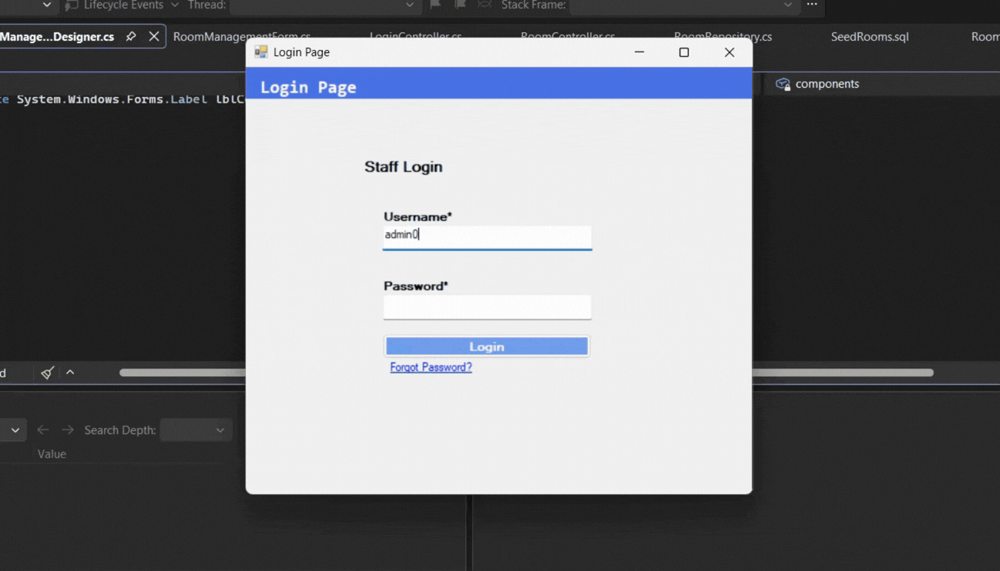

# 🏥 Room Management Module

**Language:** C# (.NET Framework 4.7.2) · **UI:** Windows Forms · **Database:** SQLite

The **Room Management** module handles all room-related operations in the Hospital Admission and Billing System. It provides full CRUD (Create, Read, Update, Delete) functionality for Admins, a read-only view for Hospital Staff, and status filtering for both roles. Built on the same layered architecture as the Login module: **Model → BusinessLogic → DB → UI**.

---

## ✨ Features

- **Create** — Admin can add a new room with number, type, rate, and status
- **Read** — View all rooms in a grid (Admin and Staff)
- **Update** — Admin can edit a room's type, rate, or status
- **Delete** — Admin can remove a room (blocked if Occupied)
- **Status Filter** — Filter rooms by All / Available / Occupied / Maintenance
- **Role-Based UI** — Admin sees Add button + Actions column; Staff has view-only access
- **Validation** — Unique room number, positive rate, no deletion of occupied rooms

Data is persisted in a local SQLite file (`HospitalDB.db`), auto-created on first run and seeded with **6 sample rooms**.

---

## 🎬 Demo

### Room Management — CRUD and Status Filter

<p align="center">
  
</p>

---

## 🗂️ Solution Structure (Room Management Files)

```
HospitalAdmissionAndBillingSystem/
│
├── Model/
│   ├── User.cs
│   └── Room.cs                              ← Room blueprint
│
├── BusinessLogic/
│   ├── Controller/
│   │   ├── LoginController.cs
│   │   └── RoomController.cs                ← Room business logic
│   └── Repository/
│       ├── UserRepository.cs
│       ├── RoomRepository.cs                ← Room data access
│       └── DatabaseInitializer.cs           ← updated for Rooms table
│
├── DB/
│   ├── Table/
│   │   ├── Users.sql
│   │   └── Rooms.sql                        ← Rooms schema
│   └── PostScript/
│       ├── SeedUsers.sql
│       └── SeedRooms.sql                    ← 6 sample rooms
│
└── UI/
    ├── LoginPage.cs
    ├── AdminMenuForm.cs
    ├── HospitalStaffMenuForm.cs
    ├── RoomManagementForm.cs                ← Main list view
    ├── RoomManagementForm.Designer.cs
    ├── AddEditRoomForm.cs                   ← Add/Edit dialog
    ├── AddEditRoomForm.Designer.cs
    ├── Program.cs
    └── App.config
```

---

## 📁 Purpose of Each Folder

| Folder | Purpose |
|--------|---------|
| `Model/` | Holds plain data classes. `Room.cs` defines the room blueprint. |
| `BusinessLogic/Controller/` | Contains `RoomController.cs` — validation and orchestration. |
| `BusinessLogic/Repository/` | Contains `RoomRepository.cs` — runs SQL against SQLite. |
| `DB/Table/` | Contains `Rooms.sql` — documents the Rooms table schema. |
| `DB/PostScript/` | Contains `SeedRooms.sql` — documents the 6 seed rooms. |
| `UI/` | Contains the Windows Forms for Room Management. |
| `UI/App_Data/` | Auto-created at runtime. Stores the SQLite database file. |

---

## 🏛️ Architecture Overview

```
┌──────────────────────────────────────────────┐
│                    UI                        │
│      RoomManagementForm + AddEditRoomForm    │
└────────────────────┬─────────────────────────┘
                     │ calls
                     ▼
┌──────────────────────────────────────────────┐
│              BusinessLogic                   │
│                                              │
│  ┌──────────────────┐  ┌─────────────────┐  │
│  │   Controller     │─▶│   Repository    │  │
│  │ (RoomController) │  │ (RoomRepository,│  │
│  │  Validation      │  │  DatabaseInit.) │  │
│  └──────────────────┘  └────────┬────────┘  │
└─────────────────────────────────┼───────────┘
                                  │
                     ┌────────────┴────────────┐
                     ▼                         ▼
              ┌─────────────┐          ┌─────────────┐
              │    Model    │          │   SQLite    │
              │  (Room.cs)  │          │ Rooms table │
              └─────────────┘          └─────────────┘
```

---

## 📄 File-by-File Reference

### `Model/Room.cs`

- **Purpose:** Blueprint for a single hospital room.
- **Namespace:** `Model`
- **Class:** `public class Room`

| Type | Name | Description |
|------|------|-------------|
| `int` | `RoomID` | Unique ID (auto-assigned by DB) |
| `string` | `RoomNumber` | Room number (e.g., 201) |
| `string` | `RoomType` | Ward, Private, Semi-Private, ICU |
| `decimal` | `Rate` | Rate per day |
| `string` | `Status` | Available, Occupied, Maintenance |

### `BusinessLogic/Repository/RoomRepository.cs`

- **Purpose:** The only class that talks to SQLite for room data.
- **Namespace:** `BusinessLogic.Repository`
- **Class:** `public class RoomRepository`

| Method | Returns | SQL |
|--------|---------|-----|
| `GetAllRooms()` | `List<Room>` | `SELECT * FROM Rooms` |
| `GetRoomByNumber(string)` | `Room` or `null` | `SELECT ... WHERE RoomNumber = @RoomNumber LIMIT 1` |
| `AddRoom(Room)` | `void` | `INSERT INTO Rooms ...` |
| `UpdateRoom(Room)` | `void` | `UPDATE Rooms SET ... WHERE RoomNumber = @RoomNumber` |
| `DeleteRoom(string)` | `void` | `DELETE FROM Rooms WHERE RoomNumber = @RoomNumber` |
| `SearchRooms(string)` | `List<Room>` | `SELECT ... WHERE RoomNumber LIKE %kw% OR RoomType LIKE %kw%` |

### `BusinessLogic/Controller/RoomController.cs`

- **Purpose:** Validates input and returns `"OK"` or an error message.
- **Namespace:** `BusinessLogic.Controller`
- **Class:** `public class RoomController`

| Method | Validation |
|--------|-----------|
| `GetAllRooms()` | passthrough |
| `GetRoomByNumber(string)` | passthrough |
| `AddRoom(number, type, rate, status)` | non-empty fields, rate > 0, unique room number |
| `UpdateRoom(number, type, rate, status)` | non-empty fields, rate > 0, room must exist |
| `DeleteRoom(number)` | room must exist, must not be Occupied |
| `SearchRooms(keyword)` | empty keyword → return all |

### `DB/Table/Rooms.sql`

```sql
CREATE TABLE IF NOT EXISTS Rooms (
    RoomID INTEGER PRIMARY KEY AUTOINCREMENT,
    RoomNumber TEXT NOT NULL UNIQUE,
    RoomType TEXT NOT NULL,
    Rate REAL NOT NULL,
    Status TEXT NOT NULL DEFAULT 'Available'
);
```

### `DB/PostScript/SeedRooms.sql`

Inserts 6 sample rooms (201–206) with different types, rates, and statuses. Not executed at runtime — mirrored inside `DatabaseInitializer.cs`.

### `UI/RoomManagementForm.cs`

- **Purpose:** Main list view — shows all rooms in a grid with status filter.
- **Namespace:** `UI`
- **Class:** `public partial class RoomManagementForm : Form`

| Method | Trigger | Action |
|--------|---------|--------|
| `RoomManagementForm_Load` | Form opens | Sets user info + role-based visibility, calls `LoadRooms()` |
| `LoadRooms()` | internal | Fetches rooms, applies status filter, populates grid |
| `cmbStatusFilter_SelectedIndexChanged` | Filter dropdown changed | Calls `LoadRooms()` |
| `btnAdd_Click` | + Add Room clicked | Opens `AddEditRoomForm(null)` |
| `dgvRooms_CellContentClick` | Actions column clicked | Prompts Edit/Delete |
| `llblNav_LinkClicked` | Main Menu / Logout | Navigates back or logs out |

### `UI/AddEditRoomForm.cs`

- **Purpose:** Modal dialog for adding or editing a single room.
- **Namespace:** `UI`
- **Class:** `public partial class AddEditRoomForm : Form`
- **Constructor:** Pass `null` for Add mode, or an existing `Room` for Edit mode.

| Method | Trigger | Action |
|--------|---------|--------|
| `AddEditRoomForm_Load` | Form opens | Sets fields based on Add vs Edit mode |
| `btnSave_Click` | Save clicked | Calls `AddRoom()` or `UpdateRoom()` |
| `btnCancel_Click` | Cancel clicked | Returns `DialogResult.Cancel` |

---

## 🗄️ Database Schema

**Table:** `Rooms`

| Column | Type | Constraints | Notes |
|--------|------|-------------|-------|
| `RoomID` | INTEGER | PRIMARY KEY AUTOINCREMENT | Auto-assigned ID |
| `RoomNumber` | TEXT | NOT NULL, UNIQUE | No duplicates |
| `RoomType` | TEXT | NOT NULL | Ward / Private / Semi-Private / ICU |
| `Rate` | REAL | NOT NULL | Rate per day |
| `Status` | TEXT | NOT NULL, DEFAULT 'Available' | Available / Occupied / Maintenance |

**Seeded data:**

| RoomNumber | RoomType | Rate | Status |
|------------|----------|------|--------|
| 201 | Ward | 800 | Available |
| 202 | Private | 2500 | Available |
| 203 | Semi-Private | 1200 | Maintenance |
| 204 | Private | 1500 | Available |
| 205 | ICU | 4000 | Available |
| 206 | Ward | 800 | Available |

**Location at runtime:** `UI/bin/Debug/App_Data/HospitalDB.db`

---

## 🔄 Data Flow

```
User                UI                Controller           Repository          SQLite
 │                  │                     │                    │                 │
 │  clicks Add ─────►│                     │                    │                 │
 │                  │  AddRoom(...) ─────►│                    │                 │
 │                  │                     │  validate ──► error│                 │
 │                  │                     │  AddRoom(Room) ───►│                 │
 │                  │                     │                    │  INSERT ──────►│
 │                  │                     │                    │◄── success ───│
 │                  │◄─── "OK" ───────────│                    │                 │
 │  sees success ◄──│                     │                    │                 │
```

---

## 👥 Team Contributions (Room Management)

| Member | GitHub | Contribution |
|--------|--------|--------------|
| Stephen William De Jesus | [@bogiiiie](https://github.com/bogiiiie) | Database (Rooms.sql, SeedRooms.sql), Backend (Room.cs, RoomRepository.cs, RoomController.cs, DatabaseInitializer update), UI code-behind (RoomManagementForm.cs, AddEditRoomForm.cs), Tester |
| Lynet Cielo | [@lynet-cielo-disputado](https://github.com/lynet-cielo-disputado) | UI Designer (RoomManagementForm.Designer.cs, AddEditRoomForm.Designer.cs) |
| Luster Tamanu Mangaliman | [@lstrmangaliman-hue](https://github.com/lstrmangaliman-hue) | Tester |
| Neil Jerson Manalo | (pending) | Backend Developer |

---

## ✅ Progress Tracker

### Done
- **US-003a Manage Rooms (Admin)** — Full CRUD with validation
- **US-003b View Room Availability (Staff)** — Read-only view with status filter

### In Progress
- **US-006 Patient Room Search** — Depends on Admission module

### Not Started
- **US-004a / US-004b** — Patient Information Maintenance
- **US-005** — Patient Info Search
- **US-007a / US-007b** — Admission
- **US-008** — Admission Log History (Optional)
- **US-009** — Treatment/Billing Breakdown
- **US-010** — Doctor/Nurse Assignment (Optional)
- **US-011a / US-011b** — Billing
- **US-012** — Discharge
- **US-013** — Discharge Summary

---

## 📋 Kanban Board

Track the project's tasks and progress:

### [🔗 View Group 4 Kanban Board](https://github.com/users/bogiiiie/projects/3)

---

## 🔑 Test Accounts

| Role | Username | Password |
|------|----------|----------|
| Admin | `admin01` | `admin123` |
| Hospital Staff | `areyes` | `staff123` |

Passwords are stored as **SHA256 hashes**, never in plain text.

---

## 🚀 How to Run

### Prerequisites
- Visual Studio with the **.NET desktop development** workload
- .NET Framework **4.7.2** (or higher)

### Steps
1. **Clone** the repository
2. **Open** `HospitalAdmissionAndBillingSystem.slnx` in Visual Studio
3. **Restore NuGet packages** — right-click solution → **Restore NuGet Packages**
4. **Set `UI` as Startup Project** — right-click `UI` → Set as Startup Project
5. Set **Platform target** to **x64** for `UI` and `BusinessLogic`
6. Press **`F5`** to build and run
7. On first run, `DatabaseInitializer.EnsureDatabase()` creates `HospitalDB.db` and seeds the Rooms table
8. Login with `admin01` / `admin123` → open **Room Management**

### Optional — Inspect the database
Install **DB Browser for SQLite** from https://sqlitebrowser.org/. Open:
```
HospitalAdmissionAndBillingSystem/UI/bin/Debug/App_Data/HospitalDB.db
```

---

## 📋 Summary Table — File Purpose in One Line

| File | Purpose |
|------|---------|
| `Model/Room.cs` | Blueprint of a room |
| `BusinessLogic/Repository/RoomRepository.cs` | Runs SQL CRUD for rooms |
| `BusinessLogic/Controller/RoomController.cs` | Validates room input |
| `BusinessLogic/Repository/DatabaseInitializer.cs` | Creates and seeds Rooms table |
| `DB/Table/Rooms.sql` | Documents the Rooms table schema |
| `DB/PostScript/SeedRooms.sql` | Documents the 6 seed rooms |
| `UI/RoomManagementForm.cs` | Main list view (grid + filter) |
| `UI/AddEditRoomForm.cs` | Add/Edit dialog |

---

## 📄 License

This project was developed as part of the **BT3101** academic requirements for **Group 4**.
```
